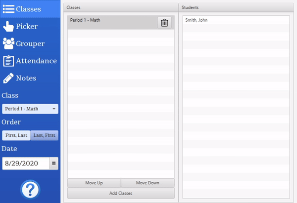

# Virtual Tools
Virtual Tools is a desktop application consisting of tools that make teaching easier. You can keep track of attendance, pick on present students, group students, and add points and notes to students for the day.

## Installation
* Go to the release page [https://github.com/jman0x0/Virtual-Tools/releases](https://github.com/jman0x0/Virtual-Tools/releases)
* If you have Java 11 or above already installed then download the jar file.
* If you don't have Java installed but you are on a Windows 10 machine, then download the windows runner.

## Program

